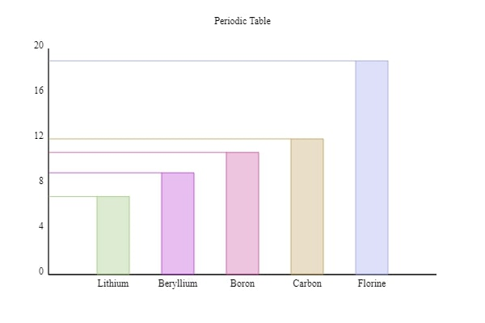

# Bar-Chart
@HTML5 @JavaScript

Simple vertical bar-charts visualizer

## Usage

Download and import bar-chart.js into Project.

```html
<script src="bar-chart.js"></script>
```

A block-level container like div is needed to visualize a bar-chart.

```html
<div id="bar-chart"></div>
```

Create a BarChart object similar to the one below.

```js
var chart = new BarChart(id, title, data)
chart.render()
```

### Parameters
- `id: String`
the id attribute of the container

- `title: String`
bar-chart title

- `data: Array({label: String, value: Number})`
bar-chart data

## Example

```html
<div id="p-table"></div>
```

```js
let data = [
    {label: 'Lithium', value: 6.9},
    {label: 'Beryllium', value: 9.0},
    {label: 'Boron', value: 10.8},
    {label: 'Carbon', value: 12.0},
    {label: 'Florine', value: 18.9},
]

var chart = new BarChart('p-table', 'Periodic Table', data)
chart.render()
```

### Output


